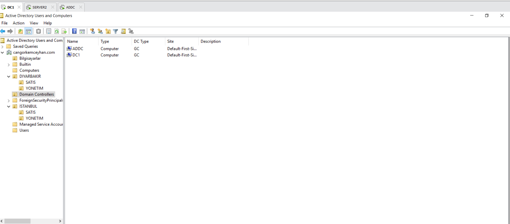
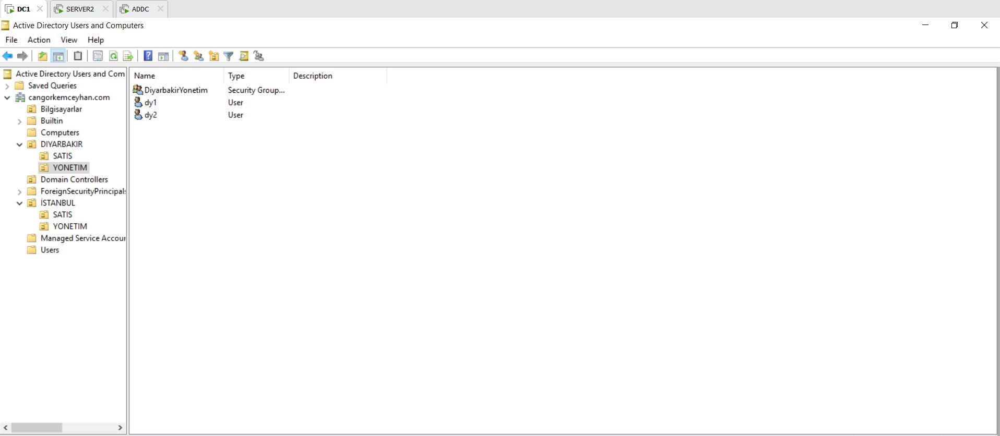
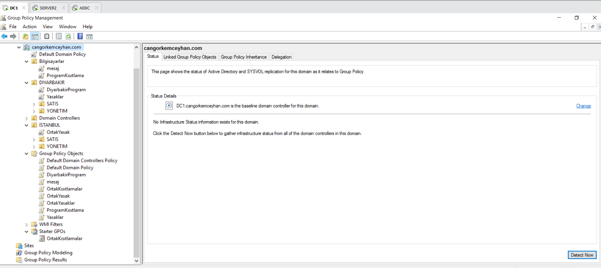
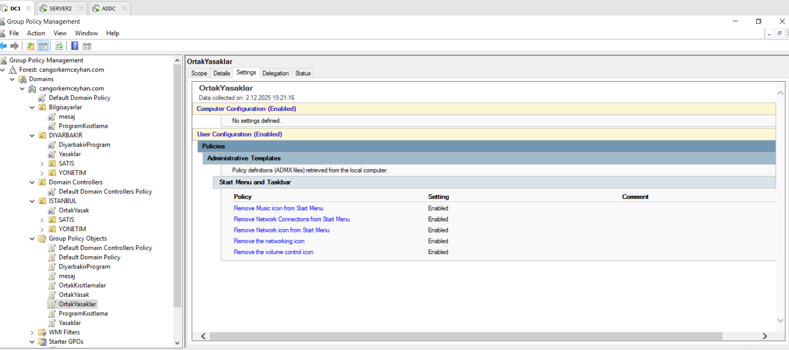
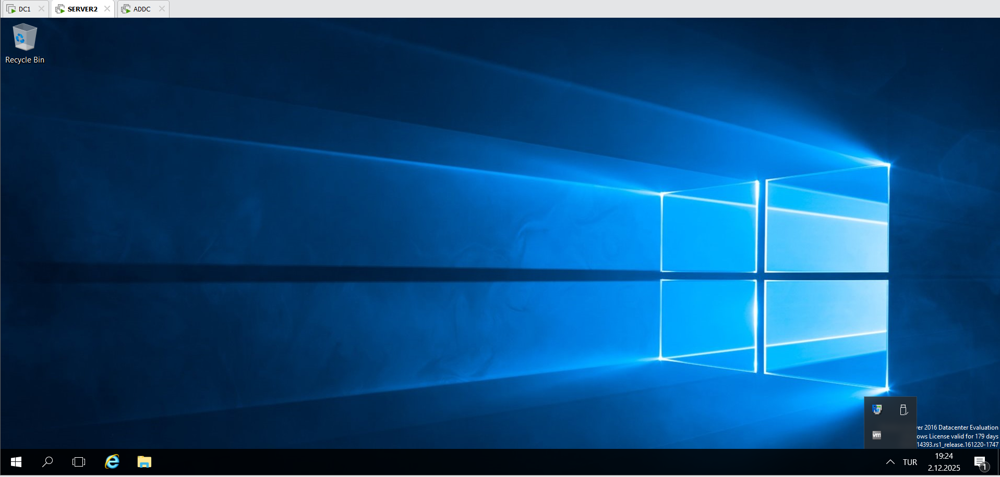
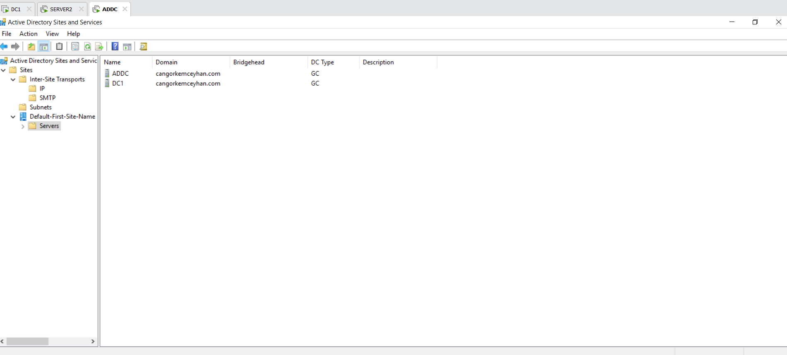

📘 Active Directory Domain Services Project

Bu proje, kurumsal ortamlarda kullanılan Windows Server 2016 tabanlı Active Directory (AD) etki alanı altyapısının sıfırdan kurulumu, yapılandırılması ve yönetimini kapsamaktadır. Modern IT & System & Network yönetimi için gerekli olan temel servisler ve gerçek senaryolara uygun güvenlik politikaları uygulanmıştır.

🚀 Proje Amacı

Kurumsal bir bilişim altyapısında ihtiyaç duyulan Domain Controller, Active Directory, OU yapısı, Grup İlkesi (Group Policy), kullanıcı ve bilgisayar yönetimi, AppLocker, symprep & cloning, yetki delegasyonu ve yedek DC (Additional Domain Controller) gibi temel bileşenleri uçtan uca uygulayarak sistem yöneticisi düzeyinde pratik deneyim kazanmak.

🏗️ Proje Kapsamı
1️⃣ Windows Server Kurulumu

Windows Server 2016 ISO kurulumu

Sunucu rollerinin yapılandırılması

Statik IP, DNS ayarları

2️⃣ Sysprep & Clone ile İstemci Hazırlığı

Sysprep ile master imaj oluşturma

Klonlanmış VM’lerin yapılandırılması

Domain'e katılacak istemcilerin hazırlanması

3️⃣ Active Directory Domain Services (AD DS)

Yeni domain kurulumu

Domain Controller (DC) rolünün eklenmesi

DNS entegrasyonu

Forest ve Domain functional level ayarlamaları

4️⃣ Additional Domain Controller (ADC)

Kurumsal yedeklilik için ikinci DC kurulumu

Replikasyon doğrulaması

FSMO rol kontrolleri

5️⃣ Active Directory Yapısı

Kurumsal Organization Unit (OU) şeması oluşturma

Users

Computers

Departments

Kullanıcı & bilgisayar hesap yönetimi

6️⃣ Group Policy Management
✔ Temel GPO Yönetimi

Kullanıcı kısıtlamaları

Bilgisayar açılış mesajı

Parola politikası

✔ Gelişmiş GPO Teknikleri

Block Inheritance

Enforced Policy

Starter GPO

Gpresult raporlama

Default Domain Policy reset

7️⃣ AppLocker – Uygulama Kısıtlama

Yetkisiz yazılım çalıştırmayı engelleyen AppLocker kuralları

Executable, Script, Installer, Packaged App kuralları

Hedef kullanıcı/grup bazlı kural setleri

8️⃣ Delegate Control (Yetki Delegasyonu)

OU bazlı kontrollü yetkilendirme

HelpDesk senaryoları için sınırlı yönetim hakları

RBAC prensiplerine uygun yapılandırma

9️⃣ Domain Join ve Uzak Yönetim

Birden fazla client makinenin domaine dahil edilmesi

Remote software installation

Uzak yönetim araçlarının kullanımı

📂 Kullanılan Teknolojiler

Windows Server 2016

Active Directory Domain Services

Group Policy Management

DNS Server

AppLocker

VMware Workstation

🖼️ Ekran Görselleri

Tüm görseller images/ klasörü içinde yer almaktadır:

🎯 Elde Edilen Yetkinlikler

Bu proje sayesinde aşağıdaki profesyonel beceriler kazanıldı:

Kurumsal AD altyapısı tasarlama

Domain Controller & Additional DC kurulumu

GPO mimarisi oluşturma ve yönetme

Güvenlik politikaları & Applocker

Sysprep ile kurumsal imaj hazırlama

DNS–AD entegrasyonu

RBAC ve Delegate Control

Uzak yönetim deneyimi

📌 Proje Durumu

Durum: ✔ Tamamlandı

Geliştirilebilir Alanlar:

DHCP

WSUS

File Server + NTFS Permissions

SIEM / Event Log incelemeleri

Failover testleri

👤 Can Görkem Ceyhan

Bu proje, bireysel öğrenme ve profesyonel gelişim amacıyla gerçekleştirilmiştir.
Gerçek kurumsal senaryolara uygun olarak tasarlanmış ve uygulanmıştır.
